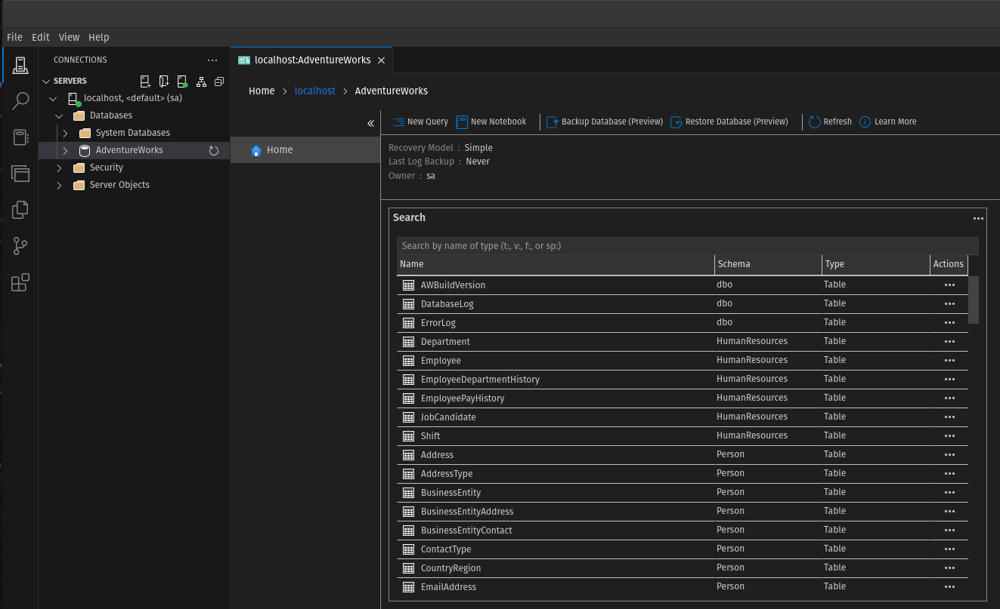

# AdventureWorks SQL Server Docker Image

Build the image with:

```sh
docker build -t sql-server-aw .
```

Run the container:

> [!TIP]
> This can be run with either [**`start-aw.sh`**](./start-aw.sh) or [**`Start-Aw.ps1`**](./Start-Aw.ps1).

```sh
docker run --rm -t --init \
      -p 1433:1433 \
      --name sql-server-aw \
      --hostname sql-server-aw \
      -e "ACCEPT_EULA=Y" \
      -e "MSSQL_SA_PASSWORD=Password1234" \
      sql-server-aw
```

After starting the container, you should see output similar to the following in the terminal:

```
2024-11-01 16:27:05.06 spid62      Synchronize Database 'AdventureWorks' (5) with Resource Database.
2024-11-01 16:27:05.08 Backup      Restore is complete on database 'AdventureWorks'.  The database is now available.
2024-11-01 16:27:05.11 Backup      Database was restored: Database: AdventureWorks, creation date(time): 2023/05/23(11:55:10), first LSN: 53:29688:1, last LSN: 53:29712:1, number of dump devices: 1, device information: (FILE=1, TYPE=DISK: {'/var/opt/mssql/backups/AdventureWorks.bak'}). Informational message. No user action required.
2024-11-01 16:27:05.14 Backup      RESTORE DATABASE successfully processed 25378 pages in 0.499 seconds (397.318 MB/sec).
Processed 25376 pages for database 'AdventureWorks', file 'AdventureWorks2022' on file 1.
Processed 2 pages for database 'AdventureWorks', file 'AdventureWorks2022_log' on file 1.
RESTORE DATABASE successfully processed 25378 pages in 0.499 seconds (397.318 MB/sec).
setup completed
/opt/mssql/bin/sqlservr
2024-11-01 16:27:05.17 spid35s     The tempdb database has 8 data file(s).
```

Connection string can be used as follows:

```json
{
  "ConnectionStrings": {
    "Db": "Server=localhost;Encrypt=Mandatory;TrustServerCertificate=True;User=sa;Password=Password1234;Database=AdventureWorks"
  }
}
```

The database should be accessible in [Azure Data Studio](https://azure.microsoft.com/en-us/products/data-studio) with the following connection details:

Parameter | Value
----------|------
Connection type | *Microsoft SQL Server*
Input type | *Parameters*
Server | **`localhost`**
Authentication type | *SQL Login*
User name | **`sa`**
Password | Value of **`$MSSQL_SA_PASSWORD`** specified when running the container.<br/>Default: **`Password1234`**
Encrypt | *Mandatory*
Trust server certificate | **`True`**

Verify the database exists:

